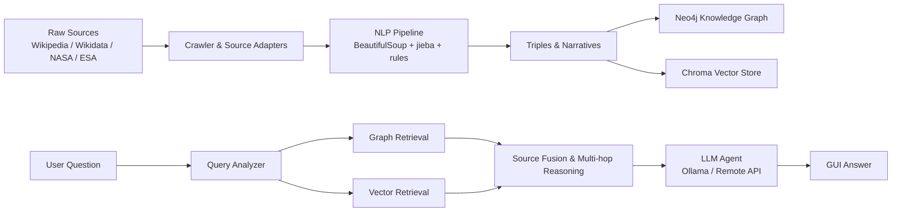

# TololoAgent

> 课程展示项目 / Course project demo  
> 作者 / Author: `baitianmeihong`  
> 用途 / Usage: 仅课程展示与学习交流。Not intended for production deployment.

TololoAgent 是一个面向太阳系天文学知识的本地知识图谱问答系统。项目把中文维基、Wikidata、NASA、ESA 等来源的天文知识整理为结构化三元组和叙事文本，再结合 Neo4j、Chroma、Ollama/远程大模型，实现可解释的中文自然语言问答、多源融合和多跳推理。

TololoAgent is a local knowledge-graph QA system for Solar System astronomy. It converts astronomy data from Chinese Wikipedia, Wikidata, NASA and ESA into triples and narrative chunks, stores them in Neo4j and Chroma, and answers Chinese natural-language questions with graph retrieval, vector retrieval, source fusion and multi-hop reasoning.

---

## 目录 / Table of Contents

- [项目亮点](#项目亮点--highlights)
- [功能概览](#功能概览--features)
- [系统架构](#系统架构--architecture)
- [目录结构](#目录结构--project-layout)
- [环境要求](#环境要求--requirements)
- [快速开始](#快速开始--quick-start)
- [本地模型安装](#本地模型安装--local-llm-installation)
- [Neo4j 配置](#neo4j-配置--neo4j-configuration)
- [数据与知识表示](#数据与知识表示--data-and-knowledge-representation)
- [NLP 处理流程](#nlp-处理流程--nlp-pipeline)
- [问答与多跳推理](#问答与多跳推理--qa-and-multi-hop-reasoning)
- [图谱可视化](#图谱可视化--graph-visualization)
- [测试与评估](#测试与评估--tests-and-evaluation)
- [安全与隐私](#安全与隐私--security-and-privacy)
- [English Overview](#english-overview)

---

## 项目亮点 / Highlights

- **知识图谱驱动问答**：用 Neo4j 存储天体、系统、参数、发现者、大气等结构化关系。
- **多源数据接入**：支持中文维基、Wikidata、NASA、ESA 的采集、物化和影子命名空间。
- **向量检索补充上下文**：Chroma 存储叙事文本，用于解释型回答。
- **多跳推理**：支持“卫星 -> 宿主行星 -> 参数/类型/大气”等链式查询。
- **多源融合与质量审查**：对不同来源的数值、实体、关系进行归一化、冲突识别和审查。
- **本地/联网模型切换**：可用 Ollama 本地 `qwen3:4b`，也可配置远程 OpenAI-compatible API。
- **桌面 GUI**：提供爬取、NLP、数据库、质量审查、可视化、问答等页面。
- **课程展示友好**：包含一键启动脚本和一键下载本地模型脚本。

---

## 功能概览 / Features

### 1. 数据采集

- 爬取或读取天文页面。
- 保存原始 HTML/JSON。
- 支持多来源数据适配。

### 2. NLP 抽取

- 使用 BeautifulSoup 解析百科 HTML。
- 使用 jieba 做中文分词、查询解析和关键词提取。
- 从 infobox、正文、章节中抽取三元组。
- 对三元组进行 ontology 校验和噪声过滤。

### 3. 知识存储

- Neo4j：存储实体节点和关系边。
- Chroma：存储叙事文本向量。
- 本地 JSON：保存 triples、narratives、raw data、评估报告。

### 4. 问答 Agent

- 解析自然语言问题。
- 检索 Neo4j 图谱和 Chroma 文本。
- 支持本地 Ollama 和远程 API。
- 输出中文回答，并尽量基于检索证据。

### 5. 多跳推理

示例：

```text
问题：火卫一绕行的行星质量是多少？
推理：火卫一 ORBITS 火星；火星 HAS_MASS 6.4169 × 10 23 kg
答案：火星质量为 6.4169 × 10 23 kg
```

```text
问题：月亮所属行星的直径与质量
推理：月亮 -> 月球；月球 ORBITS 地球；地球 HAS_RADIUS / HAS_MASS
答案：地球直径约 12,742.0 km，质量约 5.97237 × 10 24 kg
```

---

## 系统架构 / Architecture



核心链路：

```text
source_adapters / crawler
        -> nlp
        -> knowledge_graph / vector_store
        -> agent
        -> gui / visualization
```

---

## 目录结构 / Project Layout

```text
TololoAgent/
├─ main.py                         # GUI 入口
├─ config.py                       # 全局配置，敏感值优先读环境变量
├─ settings.json                   # 可公开设置，使用环境变量占位
├─ settings.local.example.json     # 本地私密配置示例
├─ 启动托洛洛GUI.bat               # Windows 一键启动 GUI
├─ 一键下载安装Qwen3-4B本地模型.bat # 下载 Ollama 本地 qwen3:4b
├─ src/
│  ├─ agent/                       # 问答 Agent、检索、多跳推理
│  ├─ crawler/                     # 页面爬取
│  ├─ gui/                         # Tkinter 桌面界面
│  ├─ knowledge_graph/             # Neo4j 导入与查询
│  ├─ nlp/                         # HTML 解析、分词、抽取、ontology
│  ├─ source_adapters/             # NASA / Wikidata / ESA 适配器
│  ├─ source_quality/              # 多源融合、值归一化、质量审查
│  ├─ vector_store/                # Chroma 向量检索
│  └─ visualization/               # Flask + D3 图谱可视化
├─ data/                           # 原始数据、三元组、叙事文本、审查数据
├─ docs/                           # 设计文档和报告
├─ evaluation/                     # 评估结果、多跳问题集
├─ scripts/                        # 数据构建、导入、评估、修复脚本
├─ tests/                          # 单元测试和回归测试
└─ tools/                          # 辅助工具
```

## 环境要求 / Requirements

- Windows 10/11
- Python 3.10+
- Neo4j Desktop 或 Neo4j Server
- Ollama（用于本地模型）
- Git

Python 依赖见：

```text
requirements.txt
```

安装依赖：

```powershell
pip install -r requirements.txt
```

---

## 快速开始 / Quick Start

### 1. 克隆项目

```powershell
git clone https://github.com/baitian-mokou/TololoAgent.git
cd TololoAgent
```

### 2. 安装 Python 依赖

```powershell
pip install -r requirements.txt
```

### 3. 配置 Neo4j 密码

推荐用环境变量，不要把真实密码写进 Git：

```powershell
$env:NEO4J_PASSWORD="你的 Neo4j 密码"
```

如果要长期保存，请在系统环境变量中配置 `NEO4J_PASSWORD`。

### 4. 下载本地大模型

双击运行：

```text
一键下载安装Qwen3-4B本地模型.bat
```

该脚本会安装/检查 Ollama，并执行：

```powershell
ollama pull qwen3:4b
```

模型会保存在 Ollama 默认用户目录，不会进入项目文件夹。

### 5. 启动项目

双击运行：

```text
启动托洛洛GUI.bat
```

或命令行运行：

```powershell
python main.py
```

---

## 本地模型安装 / Local LLM Installation

本项目默认使用：

```text
qwen3:4b
```

如果脚本失败，可以手动执行：

```powershell
ollama serve
ollama pull qwen3:4b
```

检查模型：

```powershell
ollama list
```

注意：不要把 Ollama 模型目录放进项目中。`.gitignore` 已忽略 `models/`。

---

## Neo4j 配置 / Neo4j Configuration

默认连接：

```text
URI: bolt://127.0.0.1:7687
User: neo4j
Password: from NEO4J_PASSWORD
```

环境变量：

```powershell
$env:NEO4J_URI="bolt://127.0.0.1:7687"
$env:NEO4J_USER="neo4j"
$env:NEO4J_PASSWORD="你的密码"
```

常用 Cypher 查询：

```cypher
MATCH (j {name: '木星'})-[r]-(m)
RETURN j.name AS subject, type(r) AS relation, m.name AS object
LIMIT 50;
```

查询木星卫星：

```cypher
MATCH (moon)-[:ORBITS]->(j {name: '木星'})
RETURN moon.name AS satellite, j.name AS planet
ORDER BY satellite;
```

查询多跳：

```cypher
MATCH (moon {name: '木卫一'})-[:ORBITS]->(planet)-[:HAS_MASS]->(mass)
RETURN moon.name AS moon, planet.name AS planet, mass.name AS mass;
```

---

## 数据与知识表示 / Data and Knowledge Representation

系统主要使用三元组表示知识：

```text
subject - relation - object
```

示例：

```text
火卫一 - ORBITS - 火星
火星 - HAS_MASS - 6.4169 × 10 23 kg
木卫二 - PART_OF - 伽利略卫星
伽利略卫星 - IS_A - 天然卫星群
冥王星 - HAS_ATMOSPHERE - 甲烷
```

支持的核心关系：

| Relation | 中文含义 | Example |
|---|---|---|
| `IS_A` | 类型 | `火星 IS_A 沙漠行星` |
| `PART_OF` | 属于 | `木卫一 PART_OF 伽利略卫星` |
| `ORBITS` | 绕行 | `月球 ORBITS 地球` |
| `HAS_MASS` | 质量 | `地球 HAS_MASS 5.97237 × 10 24 kg` |
| `HAS_RADIUS` | 半径 | `地球 HAS_RADIUS 6,371.0 km` |
| `HAS_DIAMETER` | 直径派生 | `地球 HAS_DIAMETER 12,742.0 km` |
| `HAS_ATMOSPHERE` | 大气成分 | `木星 HAS_ATMOSPHERE 氢` |
| `DISCOVERED_BY` | 发现者 | `土卫六 DISCOVERED_BY 克里斯蒂安·惠更斯` |
| `LOCATED_IN` | 位于 | `地球 LOCATED_IN 太阳系` |

---

## NLP 处理流程 / NLP Pipeline

NLP 模块位于 `src/nlp/`。

### 使用 BeautifulSoup

`src/nlp/preprocess.py` 使用 BeautifulSoup 解析 HTML：

- 提取 infobox 字段
- 提取页面章节
- 提取正文文本
- 过滤脚注、导航、表格噪声

主要类：

```text
WikiPreprocessor
```

主要函数：

```text
extract_infobox_fields()
extract_infobox()
extract_sections()
segment_sentences()
extract_triples()
```

### 使用 jieba

`src/nlp/query_analyzer.py` 使用 jieba 解析用户问题：

- 分词
- 实体匹配
- 关系意图识别
- 查询上下文构建

主要函数：

```text
build_query_context()
```

示例：

```text
输入：月亮所属行星的直径与质量
输出：
  primary_entity: 月球
  relation_hints: ORBITS, HAS_RADIUS, HAS_MASS
  topic_intents: diameter
```

`src/nlp/narrative_processor.py` 使用 `jieba.analyse.extract_tags()` 提取叙事文本关键词。

### 规则与 ontology 校验

`src/nlp/ontology.py` 负责：

- 关系白名单
- object 标准化
- 三元组合法性检查
- 大气成分拆分
- 噪声过滤

---

## 问答与多跳推理 / QA and Multi-hop Reasoning

核心文件：

```text
src/agent/llm_agent.py
```

主要职责：

- 检测 Ollama/远程模型
- 查询 Neo4j
- 查询 Chroma
- 多源融合
- 多跳推理
- 构造提示词
- 调用 LLM 生成回答

### 已支持的多跳模式

1. 卫星 -> 宿主天体 -> 质量

```text
火卫一 ORBITS 火星
火星 HAS_MASS 6.4169 × 10 23 kg
```

2. 卫星 -> 宿主天体 -> 类型

```text
冥卫一 ORBITS 冥王星
冥王星 IS_A 矮行星
```

3. 卫星 -> 宿主天体 -> 大气

```text
冥卫一 ORBITS 冥王星
冥王星 HAS_ATMOSPHERE 氮 / 甲烷 / 一氧化碳
```

4. 卫星 -> 所属群组 -> 群组属性

```text
木卫二 PART_OF 伽利略卫星
伽利略卫星 IS_A 天然卫星群
```

5. 条件筛选型多跳

```text
哪些属于土星系统的卫星由卡西尼发现？
```

系统会筛选：

```text
PART_OF 土星系统
DISCOVERED_BY 乔瓦尼·多梅尼科·卡西尼
```

6. 直径派生

如果知识库中只有半径，系统会派生直径：

```text
地球 HAS_RADIUS 6,371.0 km
地球 HAS_DIAMETER 12,742.0 km
```

---

## 图谱可视化 / Graph Visualization

核心文件：

```text
src/visualization/app.py
```

功能：

- 从 Neo4j 读取节点和边
- 使用 Flask 提供 `/api/graph`
- 使用 D3.js 展示导向图
- 支持节点筛选、标签筛选、连接数过滤、关系标签显示

启动后默认地址：

```text
http://127.0.0.1:5001
```

---

## 测试与评估 / Tests and Evaluation

运行核心回归测试：

```powershell
python -m unittest tests.test_query_retrieval_and_ollama_fallback tests.test_multi_source_fusion
```

多跳问题集：

```text
evaluation/multi_hop_reasoning_queries.json
```

重要测试文件：

```text
tests/test_query_retrieval_and_ollama_fallback.py
tests/test_multi_source_fusion.py
tests/test_value_normalizer.py
tests/test_neo4j_loader_graph_cleaning.py
tests/test_nasa_fact_sheet_parser.py
```

---

## 扩源预览 / Source Frontier Preview

课程展示用的扩源阶段总结见 [`docs/source_expansion_delivery_report.md`](docs/source_expansion_delivery_report.md)；通用科学网站筛选闭环总览见 [`docs/general_science_source_screening_overview.md`](docs/general_science_source_screening_overview.md)；当前项目成果总报告见 [`docs/project_current_stage_final_report.md`](docs/project_current_stage_final_report.md)；答辩材料包入口见 [`docs/project_stage_index.md`](docs/project_stage_index.md)；四源受控扩批计划见 [`docs/four_source_batch_expansion_plan.md`](docs/four_source_batch_expansion_plan.md)。

扩源前先做只读 frontier preview，查看每个来源的候选入口和跳过原因；该步骤默认不联网、不写 `data/`，也不会写 Neo4j 或 Chroma。

```powershell
python scripts/plan_four_source_batch_expansion.py --batch-size 50 --out-json evaluation\four_source_expansion\four_source_batch_plan_phase37.json --out-md docs\four_source_batch_expansion_plan.md
python scripts/run_four_source_batch_preview.py --plan-json evaluation\four_source_expansion\four_source_batch_plan_phase37.json --batch-size 50 --offline-only --out-json evaluation\four_source_expansion\four_source_batch_preview_phase38.json --out-md docs\four_source_batch_preview_phase38.md
python scripts/run_raw_shadow_batch_trial.py --sources nasa esa --limit 20 --out-json evaluation\four_source_expansion\raw_shadow_batch_trial_phase39.json --out-md docs\raw_shadow_batch_trial_phase39.md
```

```powershell
python scripts/preview_source_frontier.py --source nasa --limit 20
python scripts/preview_source_frontier.py --source esa --limit 20
python scripts/preview_source_frontier.py --source wikidata --limit 20
```

Manifest 位于：

```text
configs/source_manifests/
```

先检查 `accepted` / `skipped` 摘要，再小批量运行真实 ingestion。不要把 preview 理解为已经完成全站爬取。

需要真实扩源时，先显式抓取站内链接生成 frontier，再 raw-only 小批量采集；该流程只写 `data/raw_json/<source>/` 和 `evaluation/ingestion/<source>_manifest_ingestion_report.json`，不写 Neo4j/Chroma。

```powershell
python scripts/preview_source_frontier.py --source nasa --fetch-links --limit 150 --json-out evaluation/source_frontiers/nasa_frontier.json
python scripts/ingest_manifest_frontier.py --source nasa --limit 80 --frontier-json evaluation/source_frontiers/nasa_frontier.json
```

ESA/Wikidata 同理替换 `--source`。若网络不稳定，可复跑同一 frontier；报告会记录 fetched/skipped/failed 和原因。

采集完成后，先做本地 raw 后处理，把现有 raw JSON 转为 source-isolated triples/narratives；该步骤不联网、不写 Neo4j/Chroma，也不会清理旧数据。

```powershell
python scripts/materialize_manifest_raw_records.py --source nasa --limit 120
python scripts/materialize_manifest_raw_records.py --source esa --limit 120
python scripts/materialize_manifest_raw_records.py --source wikidata --limit 120
```

需要验证 shadow 向量写入时，先跑默认 dry-run，再显式 `--apply`；apply 只写隔离目录 `data/chroma_db_shadow/<source>/`，不替换正式 Chroma 库，也不改变默认 `zh_wikipedia` 主源。

```powershell
python scripts/materialize_shadow_from_preview.py --source nasa
python scripts/materialize_shadow_from_preview.py --source nasa --apply
```

Neo4j shadow 图谱写入后，可用只读探针生成展示报告；该命令只查询 source namespace，不删除、不写入，也不会切换默认主源。

```powershell
python scripts/probe_shadow_graph.py --source all
```

扩源状态可用本地报告汇总，不依赖 Neo4j 在线；GUI 的 Agent 页也可以在下拉框中显式选择 `auto`、`zh_wikipedia`、`nasa`、`esa`、`wikidata`，默认仍保持现有主源行为。

```powershell
python scripts/report_source_expansion_status.py
```

通用科学网页候选页可先做本地质量评分，只输出 `accepted` / `review_needed` / `exploratory` / `rejected` 报告，不联网、不写正式库：

```powershell
python scripts/score_candidate_pages.py --source generic --input-json tests/fixtures/page_quality/sample_candidates.json --report-json evaluation/source_quality/page_quality_sample_report.json
```

frontier preview 也可显式附加质量评分；默认不启用，不会阻断采集。raw-only ingest 只有显式 `--quality-report` 才把 fetched 页面评分写进报告，`--skip-rejected` 也必须手动打开。

```powershell
python scripts/preview_source_frontier.py --source nasa --quality-score --limit 20
python scripts/ingest_manifest_frontier.py --source nasa --quality-report --frontier-json evaluation/source_frontiers/nasa_frontier.json --limit 20
```

NASA/ESA 这类普通网页源的小批次扩源可使用质量门禁模板；每批完成后必须查看 rejected samples，确认没有误杀高价值 fact/mission 页面。Wikidata 不使用 metadata-only 网页评分跳过，应在 EntityData/raw 阶段单独判断。

```powershell
python scripts/preview_source_frontier.py --source nasa --fetch-links --quality-score --limit 30 --json-out evaluation/source_frontiers/nasa_quality_frontier.json
python scripts/ingest_manifest_frontier.py --source nasa --frontier-json evaluation/source_frontiers/nasa_quality_frontier.json --limit 15 --quality-report --skip-rejected
```

当前质量门禁用本地 fixture 覆盖了官方 fact/mission 页、大学实验室页、论文 abstract、商业科普页、news/RSS、gallery/video、search/tag/privacy/cookie/navigation 和短科学页。`accepted` 可以小批次进入 raw-only ingest；`review_needed` / `exploratory` 需要抽样；`rejected` 也要每批检查 samples 后再信任。

Manifest 可声明质量评分上下文：`source_mode`、`topic_taxonomy`、`quality_gate` 和 `quality_notes`。NASA/ESA 使用 `official_science`，Wikidata 使用 `entity_data`；同一个评分器会按 manifest 阈值和来源模式打分，但不会改变默认主源或自动写入正式库。

新增科学网站时，先复制 `configs/source_manifests/examples/` 里的模板，按来源类型改 `source_mode`、域名、种子、topic 和 `quality_gate`；然后先校验 manifest，再用 `--manifest` 做离线 quality preview。未注册的新 manifest 只允许预览，不直接进入 raw-only ingest；真实采集前需要先注册 source 并做小批次 trial：

```powershell
python scripts/validate_source_manifests.py --manifest-dir configs/source_manifests
python scripts/preview_source_frontier.py --manifest configs/source_manifests/examples/academic_example.json --quality-score --limit 20
python scripts/sandbox_manifest_candidates.py --manifest configs/source_manifests/examples/academic_example.json
python scripts/preview_source_frontier.py --source nasa --quality-score --limit 20
python scripts/ingest_manifest_frontier.py --source nasa --preflight-manifest --quality-report --frontier-json evaluation/source_frontiers/nasa_quality_frontier.json --limit 15
```

`sandbox_manifest_candidates.py` 是新科学网站接入前的安全预演：默认不联网，只写 `evaluation/source_quality/sandbox/` 报告，不写 `data/raw_json`、triples、Chroma 或 Neo4j。

多个候选 manifest 可以先做批量预审，生成 JSON 和 Markdown 汇总表，便于答辩展示和人工抽样：

```powershell
python scripts/report_sandbox_candidate_reviews.py --manifest-dir configs/source_manifests/examples --sandbox-dir evaluation/source_quality/sandbox --out-json evaluation/source_quality/sandbox/candidate_review_summary.json --out-md evaluation/source_quality/sandbox/candidate_review_summary.md
python scripts/report_sandbox_candidate_reviews.py --manifest-dir configs/source_manifests/candidates --sandbox-dir evaluation/source_quality/sandbox --out-json evaluation/source_quality/sandbox/candidate_science_sites_summary_phase28.json --out-md evaluation/source_quality/sandbox/candidate_science_sites_summary_phase28.md
```

`tests/fixtures/source_quality/` 中的 fixture candidate pack 用于复现实验：验证质量门如何区分事实页、论文摘要、新闻、导航、隐私和 gallery 噪声；它不是生产爬取输入。

批量预审报告还包含人工审阅字段：自动推荐不会直接批准抓取，必须经过 `review_decision` / `next_action` 指定的人工抽样确认后，才能进入小批量 trial。

需要人工回填时，先生成模板，填写后再作为只读输入重新生成汇总；`approved_for_small_batch` 只改变报告建议，不会自动运行 ingest：

```powershell
python scripts/report_sandbox_candidate_reviews.py --manifest-dir configs/source_manifests/examples --sandbox-dir evaluation/source_quality/sandbox --write-review-template evaluation/source_quality/sandbox/candidate_review_decisions_template.json
python scripts/report_sandbox_candidate_reviews.py --manifest-dir configs/source_manifests/examples --sandbox-dir evaluation/source_quality/sandbox --review-decisions evaluation/source_quality/sandbox/candidate_review_decisions_template.json
python scripts/report_sandbox_candidate_reviews.py --manifest-dir configs/source_manifests/candidates --sandbox-dir evaluation/source_quality/sandbox --write-review-template evaluation/source_quality/sandbox/candidate_science_sites_review_template_phase29.json
python scripts/report_sandbox_candidate_reviews.py --manifest-dir configs/source_manifests/candidates --sandbox-dir evaluation/source_quality/sandbox --review-decisions tests/fixtures/source_quality/candidate_review_decisions_phase29.json --out-json evaluation/source_quality/sandbox/candidate_science_sites_summary_phase29_filled.json --out-md evaluation/source_quality/sandbox/candidate_science_sites_summary_phase29_filled.md
```

人工回填为 `approved_for_small_batch` 后，还可以生成只读小批量计划预览；它只写 sandbox 报告，不执行抓取：

```powershell
python scripts/preview_approved_small_batch_plan.py --review-summary-json evaluation/source_quality/sandbox/candidate_review_summary_phase24_filled.json --out-json evaluation/source_quality/sandbox/approved_small_batch_plan.json --out-md evaluation/source_quality/sandbox/approved_small_batch_plan.md
python scripts/preview_approved_small_batch_plan.py --review-summary-json evaluation/source_quality/sandbox/candidate_science_sites_summary_phase29_filled.json --out-json evaluation/source_quality/sandbox/candidate_science_sites_approved_plan_phase29.json --out-md evaluation/source_quality/sandbox/candidate_science_sites_approved_plan_phase29.md
```

已批准候选源可先用手工保存的 offline fixture 做质量门验证；fixture schema 见 [`docs/offline_fixture_quality_schema.md`](docs/offline_fixture_quality_schema.md)，该流程仍不联网、不写正式库：

```powershell
python scripts/report_offline_fixture_quality.py --manifest-dir configs/source_manifests/candidates --source noaa_climate_candidate --source data_portal_candidate --fixture-dir tests\fixtures\source_quality --out-json evaluation\source_quality\sandbox\offline_fixture_quality_phase30.json --out-md evaluation/source_quality/sandbox/offline_fixture_quality_phase30.md
```

未来如果要进入 preview-only 网络探测，先渲染安全计划；该命令仍不联网、不执行 preview，只生成 `NOT EXECUTED` 计划：

```powershell
python scripts/render_preview_network_probe_plan.py --approved-plan-json evaluation\source_quality\sandbox\candidate_science_sites_approved_plan_phase29.json --offline-quality-json evaluation\source_quality\sandbox\offline_fixture_quality_phase30.json --out-json evaluation\source_quality\sandbox\preview_network_probe_plan_phase31.json --out-md evaluation\source_quality\sandbox\preview_network_probe_plan_phase31.md
```

网络探测真正执行前，还要生成审批包；审批包列出域名、页数、速率、风险和人工确认框，仍然 `NOT EXECUTED`：

```powershell
python scripts/render_network_probe_approval_package.py --probe-plan-json evaluation\source_quality\sandbox\preview_network_probe_plan_phase31.json --out-json evaluation\source_quality\sandbox\network_probe_approval_package_phase32.json --out-md evaluation\source_quality\sandbox\network_probe_approval_package_phase32.md
```

审批包可以再生成签收模板并回填人工决定；即使 `approved_for_preview_probe`，也只改变报告状态，不执行网络：

```powershell
python scripts/render_network_probe_approval_decisions.py --approval-package-json evaluation\source_quality\sandbox\network_probe_approval_package_phase32.json --write-template evaluation\source_quality\sandbox\network_probe_approval_decisions_template_phase33.json --out-json evaluation\source_quality\sandbox\network_probe_approval_decisions_phase33_pending.json
python scripts/render_network_probe_approval_decisions.py --approval-package-json evaluation\source_quality\sandbox\network_probe_approval_package_phase32.json --approval-decisions tests\fixtures\source_quality\network_probe_approval_decisions_phase33.json --out-json evaluation\source_quality\sandbox\network_probe_approval_decisions_phase33_filled.json --out-md evaluation\source_quality\sandbox\network_probe_approval_decisions_phase33_filled.md
```

已批准的单个候选源可以渲染手动命令卡；命令卡仍是 `NOT EXECUTED` / `MANUAL ONLY` / `PREVIEW ONLY`，只供最终人工确认：

```powershell
python scripts/render_manual_preview_command_card.py --approval-decisions-json evaluation\source_quality\sandbox\network_probe_approval_decisions_phase33_filled.json --source noaa_climate_candidate --out-json evaluation\source_quality\sandbox\manual_preview_command_card_phase34.json --out-md evaluation\source_quality\sandbox\manual_preview_command_card_phase34.md
```

最后可渲染人工执行前命令草案；草案必须标注 `NOT EXECUTED` / `DRY RUN`，只供审阅：

```powershell
python scripts/render_small_batch_command_skeleton.py --plan-json evaluation/source_quality/sandbox/approved_small_batch_plan.json --out-json evaluation/source_quality/sandbox/small_batch_command_skeleton.json --out-md evaluation/source_quality/sandbox/small_batch_command_skeleton.md
```

---

## GitHub 上传说明 / Publishing Notes

推荐提交/打包：

- `src/`
- `scripts/`
- `tests/`
- `docs/`
- `evaluation/`
- `data/`
- `requirements.txt`
- `README.md`
- `.gitignore`
- 一键启动和一键模型安装脚本

交付前请确认不要包含：

- `venv/`
- `settings.local.json`
- `error.log`
- API key、Neo4j 本地密码等私密配置
- Ollama 模型缓存或项目内模型目录（如 `models/`）
- 本地 Chroma 数据库和 `chroma_db.broken*` 备份目录

这些本地产物已由 `.gitignore` 覆盖。模型文件不要随仓库分发；需要本地模型时，通过 `一键下载安装Qwen3-4B本地模型.bat` 或手动执行 `ollama pull qwen3:4b` 重新获取。

首次发布前先做一次非破坏性检查：

```powershell
python scripts/report_local_artifacts.py
git status --short
```

确认 `venv/`、`models/`、本地 Chroma 数据库、`settings.local.json`、`error.log` 等没有出现在待提交列表后，再添加需要发布的源码、文档、脚本和测试文件。不要直接照抄 `git add .`，当前项目目录里可能有本机大文件和生成数据。

如果没有登录 GitHub，请先执行：

```powershell
gh auth login
```

或使用 GitHub Desktop。

---

## 安全与隐私 / Security and Privacy

本项目不会要求把真实 API key 写入 README 或公开配置。

推荐使用环境变量：

```powershell
$env:NEO4J_PASSWORD="your-password"
$env:TOLOLO_REMOTE_API_KEY="your-api-key"
```

`settings.json` 中只应保留占位符：

```json
{
  "connect": {
    "neo4j_password": "${NEO4J_PASSWORD}"
  },
  "llm_source": {
    "api_key": "${TOLOLO_REMOTE_API_KEY}"
  }
}
```

真实值请保存在：

```text
settings.local.json
```

该文件仅用于本机，发布前清理清单见 [GitHub 上传说明](#github-上传说明--publishing-notes)。

---

## 常见问题 / FAQ

### Q: 为什么不上传 Ollama 模型？

Ollama 模型体积较大，不适合进入 Git 仓库。本项目提供：

```text
一键下载安装Qwen3-4B本地模型.bat
```

运行后即可获得本地模型。

### Q: 为什么不上传 `venv/`？

虚拟环境与本机平台绑定，体积大且不可移植。请用：

```powershell
pip install -r requirements.txt
```

重建环境。

### Q: Neo4j 查不到结果怎么办？

检查：

1. Neo4j 是否启动。
2. `NEO4J_PASSWORD` 是否正确。
3. 是否已经导入 triples。
4. GUI 设置里的 URI、用户名、密码是否正确。

### Q: 本地模型不可用怎么办？

运行：

```powershell
ollama list
ollama pull qwen3:4b
```

然后重启 GUI。

---

## English Overview

TololoAgent is a course project that demonstrates a local astronomy knowledge-graph QA system. It focuses on Solar System knowledge and combines:

- HTML parsing with BeautifulSoup
- Chinese tokenization and query analysis with jieba
- rule-based triple extraction
- Neo4j graph storage and Cypher queries
- Chroma vector retrieval for narrative context
- Ollama local LLM or remote OpenAI-compatible APIs
- source fusion and multi-hop reasoning
- a Tkinter GUI and a D3.js graph visualization

Typical multi-hop query:

```text
Question: What is the mass of the planet orbited by Phobos?
Reasoning:
  Phobos ORBITS Mars
  Mars HAS_MASS 6.4169 × 10 23 kg
Answer:
  Mars has a mass of 6.4169 × 10 23 kg.
```

Another example:

```text
Question: The diameter and mass of the planet that the Moon belongs to
Reasoning:
  Moon ORBITS Earth
  Earth HAS_RADIUS 6,371.0 km
  Earth HAS_DIAMETER 12,742.0 km
  Earth HAS_MASS 5.97237 × 10 24 kg
```

This repository is for coursework demonstration only. Do not commit private API keys, local Neo4j passwords, virtual environments, model files, or local Chroma databases.
